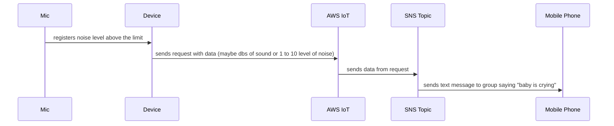

# About

Overall idea of the project is to build IoT Babysitter

## Requirements:
On any abnormal level of sound which mic is registering (baby starts to cry),
this portable device shall send SMS Text notification to group of people
(family members).

## Diagram:

## Hardware:
- ESP32 based WEMOS D1 mini (compact and has all what we need) [Documentation](https://www.wemos.cc/en/latest/d1/d1_mini.html) 

- Adafruit MAX9814 microphone with built in Amplifier 
 
- Some power (not sure yet maybe a battery, maybe some AC/DC converter to plug the device into socket)

## Software:
- AWS CDK IaC project to configure necessary permissions and setup (IoT Thing & SNS)
- Bash/Python script ( AWS Cli ) to grab necessary device certificates and store on github in this repo
- C++ code for ESP32 (also including reading and using ENV variables and Certificates before - maybe done by some python code)

