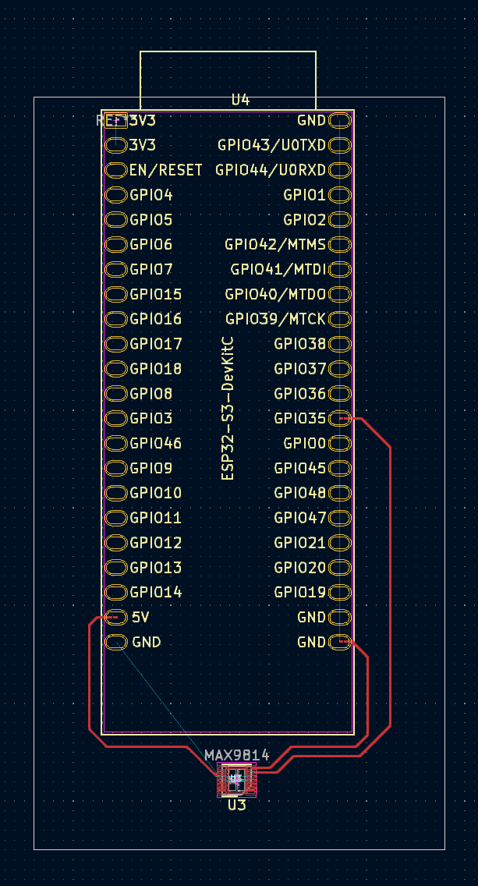
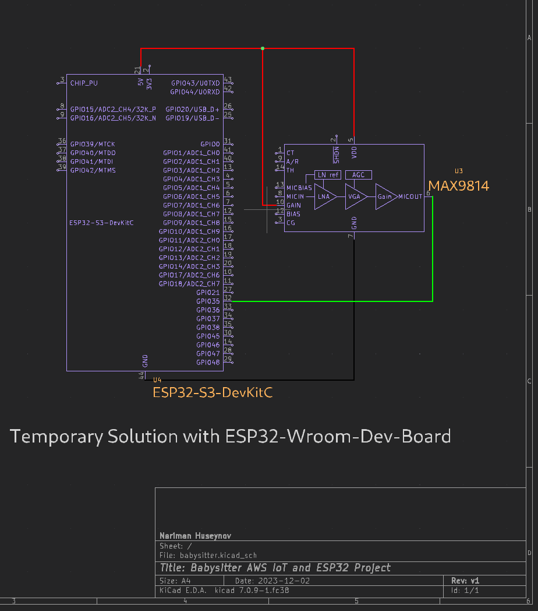
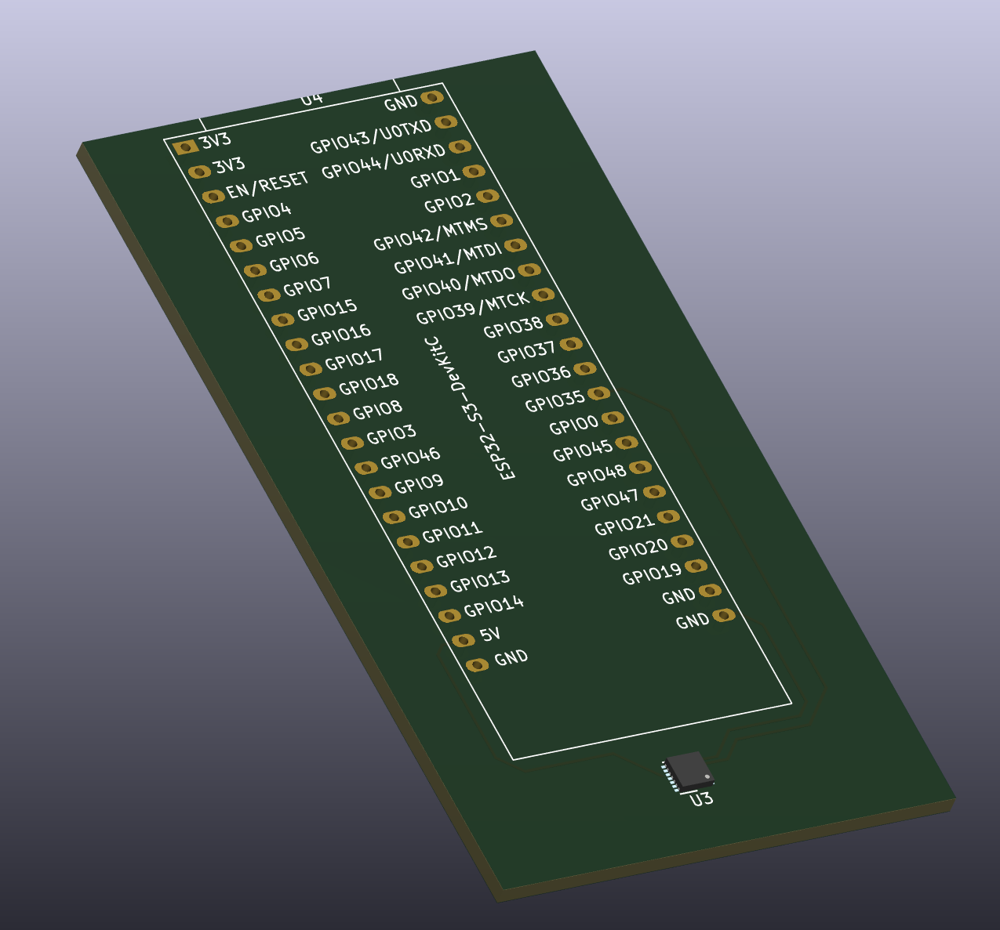

# About

Basic hardware design for Babysitter IoT device.

Wemos D1 Mini is still not delivered, so I will use ESP32-WROOM-32 devboard for now.

## PCB:

## Schematics:

## 3D (lib seem to be broken)
 

